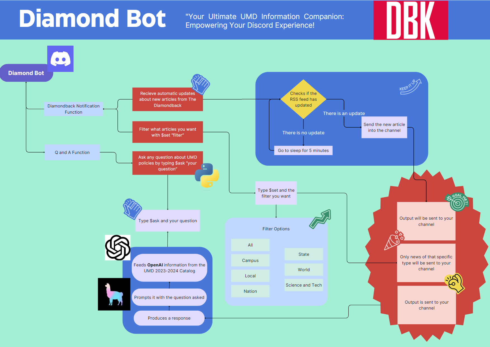

# diamondhack23

DBK Hackathon Project Outline.png
## Setup
1. Install Python 3
2. Download dependencies: `pip3 install -r requirements.txt`
3. Add discord bot token to your environment
    - `export DISCORD_BOT_TOKEN=<your_token_here>`

