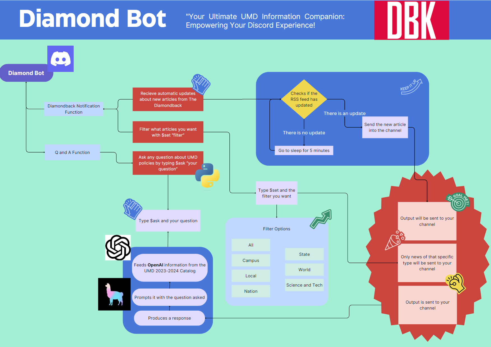

# diamondhack23

## Setup
1. Install Python 3
2. Download dependencies: `pip3 install -r requirements.txt`
3. Add discord bot token to your environment
    - `export DISCORD_BOT_TOKEN=<your_token_here>`

## Writeup
The Discord bot for all of your UMD-related info needs: 

The purpose of this bot is to provide timely information to students in a way that is easy to interact with. It notifies a server any time a new Diamondback article is posted, by parsing the RSS feed for new entries. The categories can be customized using the $set command. The bot also provides AI-assisted answers to UMD-related questions using the $ask features. We fed it documents from UMD’s websites on scholarship information, event organizing, and buildings. It uses OpenAI and Llama-index to query these documents for information and provide students with easily digestible responses to their questions (See examples). 

In the future, we would want to expand this by indexing more documents and adding more features to the bot such as allowing you to pick certain roles to receive certain infromation, or perhaps integrate other news feeds as well. This bot could be a useful resource for many UMD students who are looking for information.

